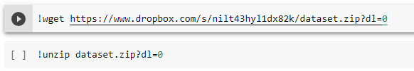
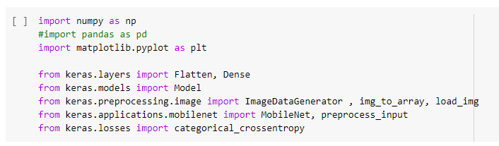
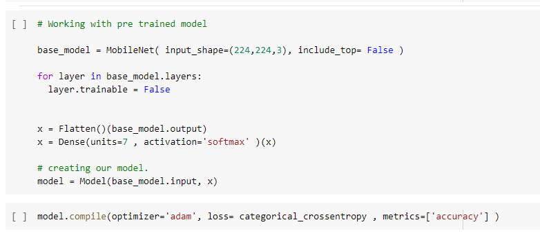
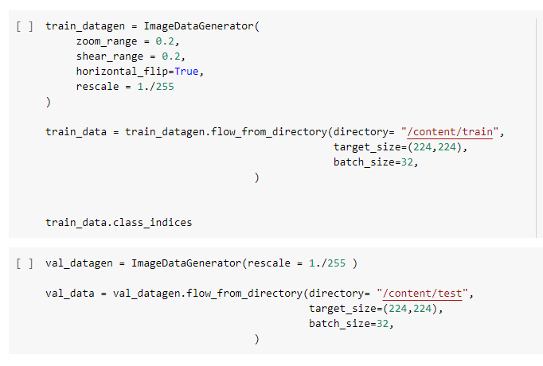
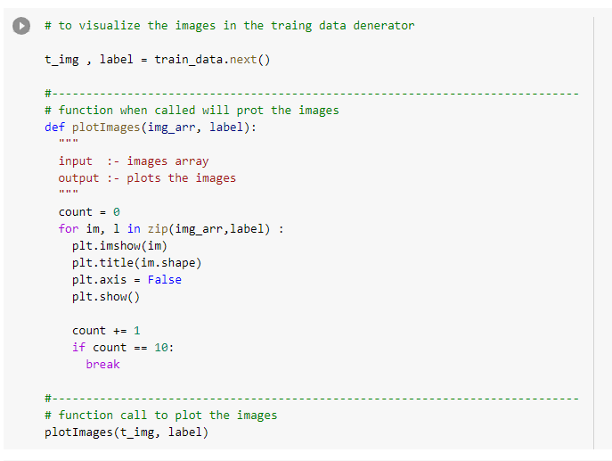
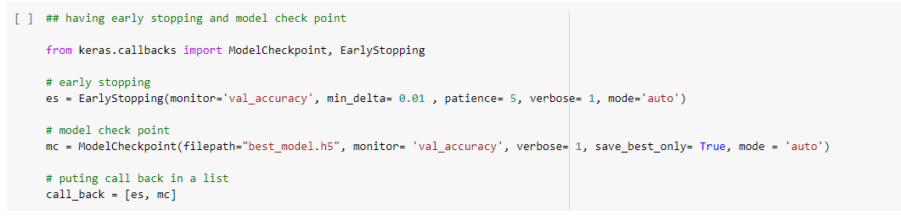
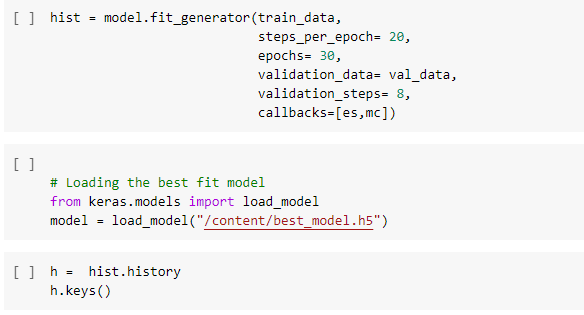
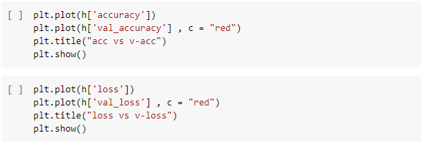
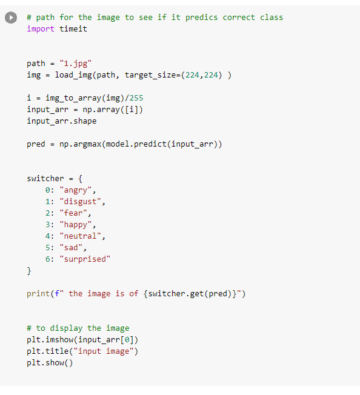

# Analyse


## Tools

Dit project gebruikt zeer veel tools en libraries.

- **Wget**: Voor het binnenhalen van de dataset vanuuit dropbox. [3.1]

- **Keras**: een API die gebruik maakt van tensorflow voor machine learning. [3.2]

- **Numpy**: een library die in veel wetenschappelijke en technische vakgebieden gebruikt wordt,maar hier gebruiken hem specifiek voor machine learning. Hij vormt de basis voor libraries zoals scikit-learn & tensorflow. [3.3]

- **Opencv**: een open source library voor machine learning en computer vision (interpretatie en begrijpen van beelden voor machines/computers). Zeer belangrijk bij object herkenning. [3.4]

- **Matplotlib**: een library voor visualisatie in python. In het project wordt het gebruikt om visueel de loss en accuracy tijdens het trainen te tonen. [3.5]

-**Opencv**: een open source library voor machine learning en computer vision [3.6] (interpretatie en begrijpen van beelden voor machines/computers). Zeer belangrijk bij object herkenning. [3.7]

## Datasets

Online zijn er verrassend weinig datasets te vinden voor emotie detectie. De meeste die er te vinden zijn, zijn meestal tegen betaling of moet je verificatie van een account hebben dat je geschikt bent om gebruik te maken van de dataset. De dataset die gebruikt werd is ene die toegankelijk staat via dropbox. Deze bevat 2 verschillende secties met beide de 7 soort basis emoties die gelezen worden. [4.1]

## Software

De nodige software die wij hiervoor gebruikt hebben is een code editor. Voor het trainen van het programma en een basis model eruit te krijgen hebben we de applicatie google collaborate gebruikt.[5.1] Verder hebben we voor de livefeed gebruik gemaakt van visual studio code.[5.2]


## Hardware

Pc met camera, de camera van de pc kan geactiveerd en uitgelezen worden via OpenCV in Python.


## Uitleg Code
### Google Collaborate

Hier werd het basis model gemaakt.

Als 1ste werd er de dataset binnengehaald vanuit de dropbox en werd deze uitgepakt zodat deze beschikbaar is voor het project.



Vervolgens worden er de basis librarys ingeladen die vereist zijn.



Hier wordt er een basismodel binnengebracht die we gebruikten. Deze zijn altijd te beschikking vanuit MobileNet.
Er worden ook reeds al kleine aanpassing gebracht aan het basismodel zodat deze geschikt is voor het project en erna wordt deze
voor het eerst gecompileerd.



De volgende stap is het trainen van het basismodel. Zoals eerder gemeld wordt er een dropbox map gebruikt voor de dataset. Deze dataset is in 2 groepen opgesplitst (train en test). Hier wordt de train gebruikt om het basismodel te trainen en daarna de test map om te kijken of het model wel correct is.



Je kan niet weten of het model effectief juist traint, dus wordt er gezorgd via een plot dat er grafieken te zien zijn.



Er wordt reeds ook een extra tool voorzien dat het trainingsproces niet onnodig blijft trainen. Deze zal na het aantal aangegeven epochs de training onderbreken indien n-aantal keer geen verbetering was t.o.v. het best gevonden model. Ook wordt steeds het beste model opgeslaan.



Vervolgens wordt er een eigen model opgebouwd vanuit het basismodel. Hier worden er meerdere zaken meegegeven voor het trainingsproces. Verder wordt reeds ook het beste model dat uit de training kwam ingeladen.



Ook met het nieuwe model worden er grafieken weergeven om de accuracy en de loss te zien van het model en zo de vooruitgang van het trainingsproces te weergeven.



Als laatste testen we het model ook uit om te zien of die effectief werkt op bestaande foto's.


### Live feed

Hier werd gebruik gemaakt van het bestemodel om via de livefeed te kijken welke gezichtuitdrukking er wordt weergeven.

Als eerste worden opnieuw alle nodige librarys ingeladen
```python
import os
import cv2
import numpy as np
from keras.preprocessing import image
import warnings
warnings.filterwarnings("ignore")
from keras.preprocessing.image import load_img, img_to_array 
from keras.models import  load_model
import matplotlib.pyplot as plt
```

Vervolgens wordt er het model ingeladen die we verkregen hadden uit het vorige deel

```python
model = load_model("best_model.h5")
```

Om vloeiend detectie te kunnen doen van het menselijk gezicht gebruiken we de tool haarcascade. Dit gaat met grote snelheid van links naar rechts en boven naar onder voor een volledige scan te doen van de gezichtsuitdrukking. Ook wordt ondertussen de camera opgestart.

```python
face_haar_cascade = cv2.CascadeClassifier(cv2.data.haarcascades + 'haarcascade_frontalface_default.xml')

cap = cv2.VideoCapture(0)
```
Nu is het de bedoeling dat zolang we het programma niet sluiten dat de haarcascade en het programma zelf blijft het werk doen. Er wordt ook nogmaals meegegeven welke soorten emoties er kunnen weergeven worden door de mens.


```python
while True:
    ret, test_img = cap.read()  # captures frame and returns boolean value and captured image
    if not ret:
        continue
    gray_img = cv2.cvtColor(test_img, cv2.COLOR_BGR2RGB)

    faces_detected = face_haar_cascade.detectMultiScale(gray_img, 1.32, 5)

    for (x, y, w, h) in faces_detected:
        cv2.rectangle(test_img, (x, y), (x + w, y + h), (255, 0, 0), thickness=7)
        roi_gray = gray_img[y:y + w, x:x + h]  # cropping region of interest i.e. face area from  image
        roi_gray = cv2.resize(roi_gray, (224, 224))
        img_pixels = image.img_to_array(roi_gray)
        img_pixels = np.expand_dims(img_pixels, axis=0)
        img_pixels /= 255

        predictions = model.predict(img_pixels)

        # find max indexed array
        max_index = np.argmax(predictions[0])

        emotions = ('angry', 'disgust', 'fear', 'happy', 'sad', 'surprise', 'neutral')
        predicted_emotion = emotions[max_index]

        cv2.putText(test_img, predicted_emotion, (int(x), int(y)), cv2.FONT_HERSHEY_SIMPLEX, 1, (0, 0, 255), 2)

    resized_img = cv2.resize(test_img, (1000, 700))
    cv2.imshow('Facial emotion analysis ', resized_img)

    #closing application
    if cv2.waitKey(10) == ord('q'):  # wait until 'q' key is pressed
        break
```

Hier wordt het programma afgesloten.

```python
cap.release()
cv2.destroyAllWindows
```


