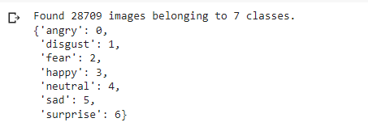
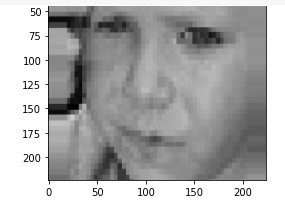
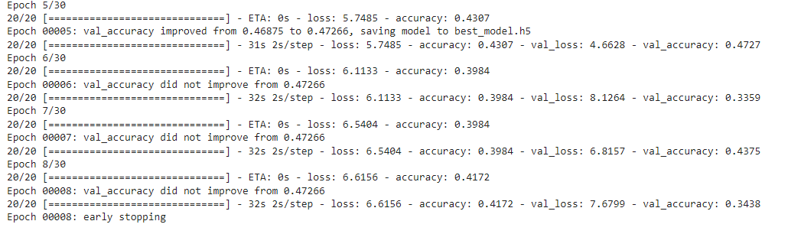
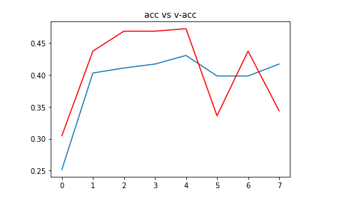
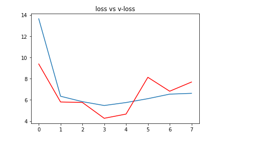

# Resultaat

Zoals je in de code kunt zien hebben we code voor verschillende soorten grafieken. De resultaten van de grafieken zullen in de zelfde volgorde worden weergeven als dat het in volgorde van de code staat.

Om te beginnen was er de eerst training die gebeurde om de 7 verschillende klassen te trainen.

Het volgende dat er gebeurde in het programma was het plotten van de resultaten van de foto's uit de huidige dataset na de 1ste training.

Vervolgens werd opnieuw een training uitgevoerd voor een nieuw model aan te maken. In de screenshot kan je waarnemen dat het beste model wordt opgeslaan en dat er een early stopping wordt gedaan.

Als laatste werden er nog de accuracy en de loss berekend. Deze werden via de plot in een tabel weergeven.

